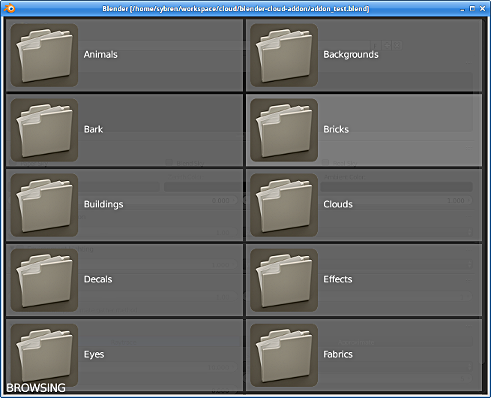
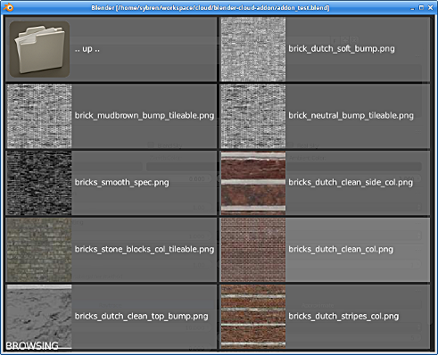

Blender Cloud addon
===================

This addon is a *proof of concept* demonstrating the following features:

* Using the [Blender ID addon](https://github.com/fsiddi/blender-id-addon)
  to authenticate against [Blender ID](https://www.blender.org/id/)
* Using the [Pillar SDK](https://github.com/armadillica/pillar-python-sdk)
  to browse the Blender Cloud texture library from within Blender.
* Using Python's [asyncio](https://docs.python.org/3/library/asyncio.html)
  module to provide asynchronous execution of Python code in Blender.


### Browsing texture folders



### Browsing textures




Installation
------------

Installation requires the [Pillar SDK](https://github.com/armadillica/pillar-python-sdk)
to be installed. It can either be installed regularly somewhere on
the Python PATH, or be stored as a [wheel file](http://pythonwheels.com/)
at `blender_cloud/wheels/pillar_sdk-*.whl`.

Installation also requires wheels for [CacheControl](https://pypi.python.org/pypi/CacheControl)
and [lockfile](https://pypi.python.org/pypi/lockfile) to be placed in
`blender_cloud/wheels`, or installed somewhere where Blender can find
them.

The above requirements can be downloaded and built automatically
by running the `build-dependency-wheels.sh` script. Only tested on
Ubuntu Linux 14.04.

The addon requires HTTPS connections, and thus is dependent on
[D1845](https://developer.blender.org/D1845). You can do either of
these:

* Build Blender yourself
* Get a recent copy from the buildbot
* Copy certificate authority certificate PEM file to
  `blender/2.77/python/lib/python3.5/site-packages/requests/cacert.pem`.
  You can use the same file from your local requests installation, or
  use `/etc/ssl/certs/ca-certificates.crt`.

As a final step, install and log in with the
[Blender ID addon](https://github.com/fsiddi/blender-id-addon).

Running the addon
-----------------

After installing the Blender Cloud addon, log in with the Blender ID
(in the addon preferences). Then activate the Blender Cloud addon,
and press Ctrl+Alt+Shift+A to activate it (yes, this needs work).
Downloaded textures are loaded into image datablocks.
The download location can be configured using the
`bpy.context.scene.blender_cloud_dir` property (no GUI yet).


Design
------

The addon code is designed around Python's [asyncio](https://docs.python.org/3/library/asyncio.html)
module. This allows us to perform HTTP calls (and other longer-lasting
operations) without blocking Blender's user interface.

### Motivation for asyncio

These are the motivations to choose asyncio in favour of alternatives:

1. Bundled with Python and supported by new syntax, most notably the
   `await` and `async def` statements.
2. Allows for clear "handover points", where one task can be suspended
   and another can be run in its place. This provides for a much more
   deterministic execution flow than possible with multi-threading.
3. Support for calling callbacks in the same thread that runs the event
   loop. This allows for elegant parallel execution of tasks in different
   threads, while keeping the interface with Blender single-threaded.
4. Support for wrapping non-asyncio, blocking functionality (that is,
   the asynchronous world supports the synchronous world).
5. Support for calling `async def` methods in a synchronous way (that is,
   the synchronous world supports the asynchronous world).
6. No tight integration with Blender, making it possible to test
   asynchronous Python modules without running Blender.

### The asyncio event loop

The [event loop](https://docs.python.org/3/library/asyncio-eventloop.html)
is the central execution device provided by asyncio. By design it blocks
the thread, either forever or until a given task is finished. It is
intended to run on the main thread; running on a background
thread would break motivation 3 described above. For integration with
Blender this default behaviour is unwanted, which is solved in the
`blender_cloud.async_loop` module as follows:

1. `ensure_async_loop()` starts `AsyncLoopModalOperator`.
2. `AsyncLoopModalOperator` registers a timer, and performs a single
   iteration of the event loop on each timer tick.
   As only a single iteration is performed per timer tick, this only
   blocks for a very short time -- sockets and file descriptors are
   inspected to see whether a reading task can continue without
   blocking.
3. The modal operator stops automatically when all tasks are done.


### Recommended workflow

To start an asynchronous task and be notified when it is done, use the
following. This uses the Blender-specific `async_loop` module.


```python
import asyncio
from blender_cloud import async_loop

async def some_async_func():
    return 1 + 1

def done_callback(task):
    print('Task result: ', task.result())

async_task = asyncio.ensure_future(some_async_func())
async_task.add_done_callback(done_callback)
async_loop.ensure_async_loop()
```

To start an asynchronous task and block until it is done, use the
following.

```python
import asyncio

async def some_async_func():
    return 1 + 1

loop = asyncio.get_event_loop()
res = loop.run_until_complete(some_async_func())
print('Task result:', res)
```


Communication & File Structure
------------------------------

### Assumptions

* Cache is user-global, stored in an OS-specific location, and can be removed/recreated. This
  document refers to that location as `$CACHE`, and is typically a directory like
  `$HOME/.cache/blender/blender_cloud`. Also see
   [T47684](https://developer.blender.org/T47684). This directory should not be tied to the
   version of Blender -- malformed/invalid caches should just be ignored or removed.
* At the moment, versioning of files is limited to re-syncing to get the latest versions. More
  extensive versioning falls under the umbrella of "asset management" and is out of scope of
  this addon.
* Users can download texture nodes. Such a download may result in multiple files on the local
  filesystem (think of one texture node containing diffuse, bump and specular maps).

### Caching

Caching is performed at different levels:

* Caching of HTTP GET requests is performed by [CacheControl](https://cachecontrol.readthedocs.org/).
  
    * Cache is stored in `$CACHE/{username}/blender_cloud_http/`; by using the file
      backend, we ensure cache persistence across Blender runs. This
      does require the `lockfile` package to be installed or bundled.
    * The code is cache-aware and uses the CacheControl-managed session object.
      This allows for more granular control over where in the code cache is (not) used.
    * Uncached HTTP requests user another session object to allow
      connection pooling.

* Downloaded thumbnails are cached (by us) in `$CACHE/thumbnails/{node_uuid}/{filename}`.

    * Use a non-cached HTTP GET to download these.
    * A subset of HTTP headers are stored as JSON key/value pairs in `$CACHE/thumbnails/{node_uuid}/{filename}.headers`.
    * Use the ETag and If-Modified-Since headers to prevent unnecessary re-downloading.
    * Check Content-Length header against actual file size to detect partially-downloaded files that need re-downloading.
    * A file download is only attempted once per Blender session.
    
* Downloaded files (such as textures) are handled in the same way as thumbnails (described above),
  but have their metadata stored somewhere else (described below).

### Filesystem Layout

* Top-level texture directory, referred to as `$TEXTURES` in this document, can be configured per
  Blender scene. It  defaults to a global addon preference, which in turns defaults to `//textures`.
* Texture files are stored in `$TEXTURES/{project_name}/{node_name}/{node_name}/.../{file_variant}-{file_name}`.
  `{file_variant}` is "col" for colour/diffuse textures, "nor" for normal/bump textures, etc.
* Metadata is stored in `$TEXTURES/.blender_cloud`, with the following subdirectories:

    * `files/{file_uuid}.json` containing the file document from Pillar
    * `files/{file_uuid}.headers` containing a subset of the HTTP headers received while downloading the file

In the future we might add:

* `projects/{project_uuid}.json` containing the project document from Pillar
* `nodes/{node_uuid}.json` containing the node document from Pillar
* `index.sqlite` containing a mapping from `{project_name}/{node_name}/{node_name}/...`
  to the UUID of the last-named path component (project, node, or file). This allows us
  to map the path of a filesystem path to its Pillar document.
